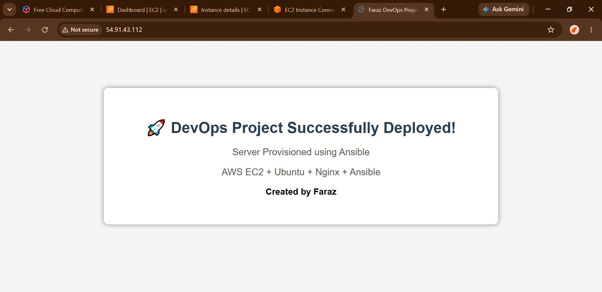

# Ansible Linux Server Configuration on AWS EC2

## Project Overview

This project demonstrates the automation of Linux server provisioning and configuration on AWS EC2 using Ansible.

The primary objective of this project is to eliminate manual server configuration by implementing Infrastructure as Code (IaC) practices.

Instead of manually installing packages, configuring services, and deploying applications, all tasks are automated using Ansible playbooks and roles.

This project provisions an Ubuntu server on AWS EC2, installs essential utilities, configures an Nginx web server, and deploys a custom HTML website automatically.

---

# Project Objectives

* Learn Infrastructure as Code (IaC).
* Understand Ansible architecture and workflow.
* Automate Linux server configuration.
* Deploy and configure Nginx automatically.
* Deploy a custom static website using Ansible.
* Gain practical DevOps experience on AWS Cloud.

---

# Technologies Used

| Technology   | Purpose                       |
| ------------ | ----------------------------- |
| AWS EC2      | Cloud virtual machine hosting |
| Ubuntu Linux | Operating System              |
| Ansible      | Configuration Management Tool |
| SSH          | Secure remote communication   |
| Nginx        | Web Server                    |
| Git          | Version Control               |
| GitHub       | Source Code Repository        |
| HTML/CSS     | Website Deployment            |

---

# Project Architecture

```text
+-----------------------+
| Ansible Controller    |
| AWS EC2 Ubuntu Server |
+-----------+-----------+
            |
            | SSH
            |
+-----------v-----------+
| Managed Node          |
| AWS EC2 Ubuntu Server |
+-----------------------+
```

Ansible communicates with managed nodes using SSH.

---

# Phase 1: AWS EC2 Instance Creation

## Objective

Create a cloud-based Ubuntu server on AWS.

## Activities Performed

* Logged into AWS Console.
* Opened EC2 Dashboard.
* Launched a new Ubuntu EC2 instance.
* Selected Ubuntu AMI.
* Selected instance type.
* Created a Key Pair.
* Downloaded the `.pem` file.
* Launched the instance.

## Why This Phase Was Required

Ansible requires Linux servers to manage and configure.

The EC2 instance serves as:

* Ansible Controller
* Target Linux Server

## Output

Successfully created an Ubuntu EC2 instance with a public IP.

Example Output (According to your own PUBLIC IP):

```text
54.83.111.68 
```

---

# Phase 2: Security Group Configuration

## Objective

Allow external connections to the server.

## Configured Inbound Rules

| Service | Port |
| ------- | ---- |
| SSH     | 22   |
| HTTP    | 80   |
| HTTPS   | 443  |

## Why This Phase Was Required

SSH access is required for:

* Remote server login
* Ansible communication

HTTP access is required for:

* Accessing deployed websites

## Output

Server became accessible over:

```text
SSH → Port 22
HTTP → Port 80
```

---

# Phase 3: SSH Key Pair Management

## Objective

Enable secure authentication.

## Key File Used

```text
anisible-key.pem
```

## Why This Phase Was Required

AWS uses public-key authentication instead of passwords.

The private key authenticates the user securely.

## Commands Used

SSH connection:

54.83.111.68 ---> (Replace with your PUBLIC IP)

```bash
ssh -i "anisible-key.pem" ubuntu@54.83.111.68
```

## Command Explanation

| Part         | Purpose                       |
| ------------ | ----------------------------- |
| ssh          | Opens secure shell connection |
| -i           | Specifies private key         |
| ubuntu       | Username                      |
| 54.83.111.68 | Target server IP              |

## Output

Successful remote login into EC2.

```text
ubuntu@ip-172-31-18-213:~$
```

---

# Phase 4: Ansible Installation

## Objective

Install Ansible on Ubuntu.

## Commands Used

Update package index:

```bash
sudo apt update
```

Install Ansible:

```bash
sudo apt install ansible -y
```

Verify installation:

```bash
ansible --version
```

## Why These Commands Were Used

### apt update

Downloads latest package metadata.

### apt install ansible

Installs Ansible packages.

### ansible --version

Verifies successful installation.

## Output

```text
ansible [core 2.x.x]
```

---

# Phase 5: Project Directory Creation

## Objective

Organize project files professionally.

## Commands Used

```bash
mkdir ansible-linux-project
cd ansible-linux-project
```

## Why This Phase Was Required

To maintain clean project structure and separate automation files.

## Output

Project directory created.

---

# Phase 6: Role-Based Project Structure

## Objective

Follow industry-standard Ansible practices.

## Commands Used

```bash
mkdir -p roles/base/tasks
mkdir -p roles/nginx/tasks
mkdir -p roles/app/tasks
mkdir -p roles/app/files
mkdir -p roles/ssh/tasks
```

Create files:

```bash
touch inventory.ini
touch setup.yml
touch roles/base/tasks/main.yml
touch roles/nginx/tasks/main.yml
touch roles/app/tasks/main.yml
touch roles/ssh/tasks/main.yml
```

## Why Roles Were Used

Roles make automation:

* Modular
* Reusable
* Scalable
* Easy to maintain

## Final Structure

```text
.
├── inventory.ini
├── README.md
├── setup.yml
└── roles
    ├── app
    │   ├── files
    │   └── tasks
    ├── base
    │   └── tasks
    ├── nginx
    │   └── tasks
    └── ssh
        └── tasks
```

---

# Phase 7: Inventory Configuration

## Objective

Tell Ansible which servers to manage.

## File

```text
inventory.ini
```

## Configuration
54.83.111.68 ---> (Replace with your PUBLIC IP)
```ini
[web]
54.83.111.68 ansible_user=ubuntu ansible_ssh_private_key_file=/home/ubuntu/anisible-key.pem
```

## Explanation

| Parameter        | Purpose            |
| ---------------- | ------------------ |
| [web]            | Server group       |
| IP Address       | Target machine     |
| ansible_user     | SSH user           |
| private_key_file | Authentication key |

---

# Phase 8: Connectivity Verification

## Objective

Verify communication between controller and target.

## Command Used

```bash
ansible web -i inventory.ini -m ping
```

## Command Explanation

| Component | Purpose          |
| --------- | ---------------- |
| ansible   | Executes Ansible |
| web       | Host group       |
| -i        | Inventory file   |
| -m ping   | Ping module      |

## Why This Test Was Important

To confirm:

* SSH connectivity
* Inventory correctness
* Key authentication
* Ansible communication

## Output
[54.83.111.68] ---> (Ouput shown according to your PUBLIC IP)
```json
54.83.111.68 | SUCCESS => {
    "ping": "pong"
}
```

---

# Phase 9: Playbook Development

## Objective

Automate server configuration.

## File

```text
setup.yml
```

## Content

```yaml
---
- name: Configure Linux Server
  hosts: web
  become: yes

  roles:
    - base
    - nginx
    - app
    - ssh
```

## Explanation

| Parameter | Purpose                  |
| --------- | ------------------------ |
| hosts     | Target group             |
| become    | Run as root              |
| roles     | Execute automation tasks |

---

# Phase 10: Base Role Implementation

## Objective

Prepare server environment.

## Tasks Performed

* Update package cache.
* Upgrade system packages.
* Install utilities.

## Installed Packages

```text
curl
wget
git
vim
```

## Why These Utilities Were Installed

| Package | Purpose               |
| ------- | --------------------- |
| curl    | API and HTTP requests |
| wget    | Download files        |
| git     | Version control       |
| vim     | File editing          |

---

# Phase 11: Nginx Role Implementation

## Objective

Install and configure Nginx.

## Tasks

```yaml
Install Nginx
Start Nginx Service
Enable Service on Boot
```

## Why Nginx Was Used

Nginx is:

* Lightweight
* High performance
* Industry standard

## Output

Nginx became accessible on (YOUR OWN PUBLIC IP):

```text
http://54.83.111.68
```

---

# Phase 12: Custom Website Deployment

## Objective

Deploy custom website automatically.

## File

```text
roles/app/files/index.html
```

## Ansible Task

```yaml
- name: Deploy custom website
  copy:
    src: index.html
    dest: /var/www/html/index.html
```

## Why Copy Module Was Used

The copy module transfers local files to remote machines.

## Output

Default Nginx page replaced with:

```text
🚀 DevOps Project Successfully Deployed!
Server Provisioned using Ansible
AWS EC2 + Ubuntu + Nginx + Ansible
Created by Faraz
```

---

# Phase 13: Playbook Execution

## Command

```bash
ansible-playbook -i inventory.ini setup.yml
```

## Why This Command Was Used

Executes all automation tasks defined in the playbook.

## Output

```text
PLAY RECAP

ok=6
changed=3
failed=0
```

Meaning:

* Tasks executed successfully.
* No failures occurred.

---

# Key Learning Outcomes

Through this project I learned:

* AWS EC2 provisioning
* Linux administration
* SSH authentication
* Ansible architecture
* Inventory management
* Playbook development
* Role-based automation
* Infrastructure as Code (IaC)
* Nginx administration
* Automated application deployment

---

# Future Enhancements

* Multi-server deployment.
* Dynamic inventory integration.
* GitHub Actions CI/CD pipeline.
* Docker container deployment.
* Monitoring using Prometheus and Grafana.
* Security hardening automation.

---

# Live Project URL & Screenshot
54.83.111.68 ---> (To view Live Output Replace with your PUBLIC IP)
```text
http://54.83.111.68
```

---



---

# Project Page URL

https://roadmap.sh/projects/configuration-management

---

# Author

**Faraz Shabbir**

* DevOps Enthusiast | Linux Administrator | Cloud Learner
* 🔗 LinkedIn  https://www.linkedin.com/in/faraz-shabbir-5a9227344/

